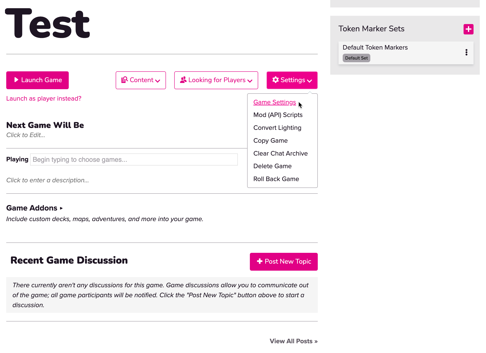
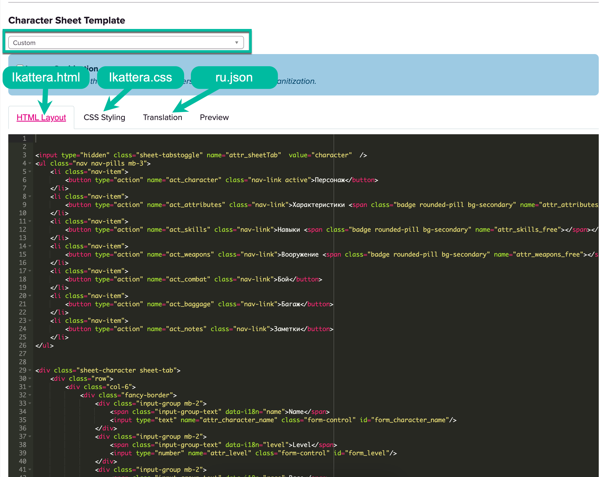

# Ikattera role playing game character sheet

To configure character sheet template you as game master should be pro member of roll20. You need to navigate to your game settings

Then scroll down to the bottom of the page.
* Select "Custom template"
* Upload data from ikattera.html to **HTML Layout** tab
* Upload data from ikattera.css to **CSS Styling** tab
* Upload data from desired translation such as **ru.json** to **Translation** tab
* Click save changes
* 
